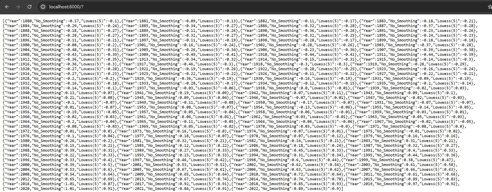
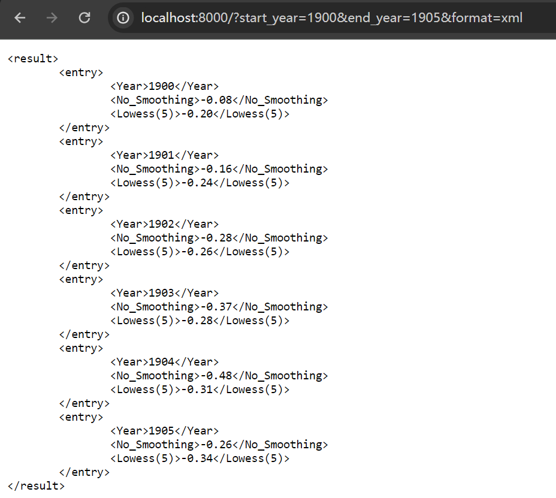
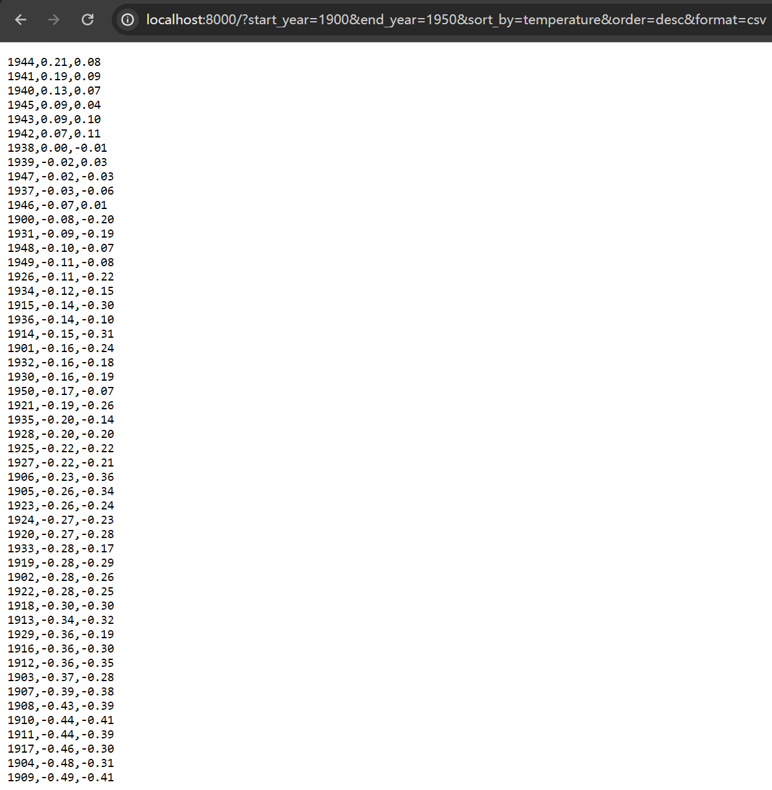

# 1 Python程序设计#2作业
班级：307

学号：2021211138

姓名：陈朴炎
## 1.1 作业题目
数据文件（graph.txt）是一个全球温度年度异常历史数据。基于Sanic实现一个查询服务，服务包括：
- 按起始和结束年份查询历史数据，查询结果支持多种格式：JSON、XML、CSV（用逗号作为间隔
符）。
- 按温度高低进行排序，支持升序和降序两种排序方式。
## 1.2 作业内容
程序源代码：
```py
from sanic import Sanic, response
import pandas as pd
import xml.etree.ElementTree as ET
app = Sanic(__name__)

data_file = "graph.txt"
df = pd.read_csv(data_file, sep="\s+", comment="#", names=["Year", "No_Smoothing", "Lowess(5)"])

# 路由器根目录定义为 /
@app.route("/")
async def query_data(request):

    start_year = int(request.args.get("start_year", 1880))
    end_year = int(request.args.get("end_year", 2022))
    sort_by = request.args.get("sort_by", "year")  # 默认按年份排序
    order = request.args.get("order", "asc")    # 默认升序

    # 排序
    filtered_data = df[(df['Year'] >= start_year) & (df['Year'] <= end_year)]
    if sort_by == "temperature":
        filtered_data = filtered_data.sort_values(by='No_Smoothing', ascending=(order == 'asc'))
    else:
        filtered_data = filtered_data.sort_values(by='Year' if order == "asc" else '-Year')

    # 判断查询结果格式
    result_format = request.args.get("format", "json")

    if result_format == "json":
        result = filtered_data.to_dict(orient="records")
        return response.json(result)
    
    elif result_format == "xml":
        # 生成XML格式的文本响应
        xml_result = "<result>\n"
        for index, row in filtered_data.iterrows():
            year = int(row['Year'])
            no_smoothing = row['No_Smoothing']
            lowess = row['Lowess(5)']
            xml_result += f"\t<entry>\n\t\t<Year>{year}</Year>\n\t\t<No_Smoothing>{no_smoothing:.2f}</No_Smoothing>\n\t\t<Lowess(5)>{lowess:.2f}</Lowess(5)>\n\t</entry>\n"
        xml_result += "</result>"
        return response.text(xml_result, content_type="text/plain")

    elif result_format == "csv":
        text_result = ""
        for index, row in filtered_data.iterrows():
            year = int(row['Year'])
            text_result += f"{year},{row['No_Smoothing']:.2f},{row['Lowess(5)']:.2f}\n"
        return response.text(text_result, content_type="text/plain")

    return response.text("Invalid format requested", status=400)

if __name__ == "__main__":
    app.run(port=8000)

```
## 1.3 代码说明
```py
data_file = "graph.txt"
df = pd.read_csv(data_file, sep="\s+", comment="#", names=["Year", "No_Smoothing", "Lowess(5)"])
```
这两行代码定义了首先定义了读入的文件名，下一行pd.read_csv函数将读取data_file的结果返回给df，其中读取的方式是csv文件格式，其中sep参数表示该文件的分隔符为一个或多个空格，comment表示这个文件的注释格式是以#开头的那一行，names代表表头，读取的每一行数据分别代表Year、No_Smoothing、Lowess(5)

```py
@app.route("/")
```
表示把路由器的根目录定义为 / ，表示我将在我的网页后面直接写入查询语句。比如我的服务器网页是http://127.0.0.1:8000，那么我的查询语句query就会放在http://127.0.0.1:8000/?query里

```py
async def query_data(request):
```
async是异步函数的定义，用于处理 HTTP 请求。async 关键字用于定义异步函数，这允许我这个查询函数在执行可能会耗费一些时间的操作时，让出 CPU 控制权，从而不会阻塞其他任务的执行。HTTP 请求会被传递给这个函数，在函数内部处理请求并生成响应。

```py
    start_year = int(request.args.get("start_year", 1880))
    end_year = int(request.args.get("end_year", 2022))
    sort_by = request.args.get("sort_by", "year")  # 默认按年份排序
    order = request.args.get("order", "asc")    # 默认升序
```
这段代码用来获取请求中的起止年份和按哪个参数排序，怎么排序。开始年份如果没有，就默认为1880，结束年份如果没有，就设置成2022。排序的参考如果没有，就设置为year，默认为按年份排序，排序的升降序默认为升序。
```py
    filtered_data = df[(df['Year'] >= start_year) & (df['Year'] <= end_year)]
    if sort_by == "temperature":
        filtered_data = filtered_data.sort_values(by='No_Smoothing', ascending=(order == 'asc'))
    else:
        filtered_data = filtered_data.sort_values(by='Year' if order == "asc" else '-Year')
```
这边先将数据按年份过滤出来，找出从start_year到end_year里的所有数据。之后看查询语句里是否有设置sort_by参数，如果设置了sort_by参数为temperature，那么就按照温度排序，否则就按照年份来排序。如果还设置了order参数，order参数如果不是asc的话就按照降序，如果没有设置order参数或者order参数为asc则默认为升序排序。
```py
    result_format = request.args.get("format", "json")
```
这里我们将查询语句中的format参数提取出来，如果没有设置format的话，默认为json。
```py
    if result_format == "json":
        result = filtered_data.to_dict(orient="records")
        return response.json(result)
```
这几行代码用来处理format为json的查询结果。将已经过滤排序好的数据通过json封装好，打印出来。
```py
    elif result_format == "xml":
        # 生成XML格式的文本响应
        xml_result = "<result>\n"
        for index, row in filtered_data.iterrows():
            year = int(row['Year'])
            no_smoothing = row['No_Smoothing']
            lowess = row['Lowess(5)']
            xml_result += f"\t<entry>\n\t\t<Year>{year}</Year>\n\t\t<No_Smoothing>{no_smoothing:.2f}</No_Smoothing>\n\t\t<Lowess(5)>{lowess:.2f}</Lowess(5)>\n\t</entry>\n"
        xml_result += "</result>"
        return response.text(xml_result, content_type="text/plain")
```
这段代码用来处理format为xml的查询结果。首先查询结果包裹在<result> </result>里面，每行结果都处在单独的子控件<entry> </entry>,entry里面又包括了<Year></Year>、<No_Smoothing></No_Smoothing>、<Lowess(5)></Lowess(5)>，用来存放Year、No_Smoothing、Lowess(5)的信息。
```py
    elif result_format == "csv":
        text_result = ""
        for index, row in filtered_data.iterrows():
            year = int(row['Year'])
            text_result += f"{year},{row['No_Smoothing']:.2f},{row['Lowess(5)']:.2f}\n"
        return response.text(text_result, content_type="text/plain")
```
这段代码用来处理format为csv的格式，将每个信息都加入到文本中，用逗号分隔，最后返回。
```py
return response.text("Invalid format requested", status=400)
```
要是不匹配的话就输出错误信息，状态信息设置为400
```py
if __name__ == "__main__":
    app.run(port=8000)
```
主函数中将sanic服务器运行起来，放在本机的8000端口用来监听http请求。
## 1.4 运行结果
输入查询语句

```
http://localhost:8000/?
```

<div style="text-align:center">
    图1-1 默认搜索结果
</div>

输入语句
```
http://localhost:8000/?start_year=1980&format=xml
```


<div style="text-align:center">
    图1-2 xml搜索结果
</div>

输入语句查询从1900到1950，以温度降序的结果，返回csv格式
```
http://localhost:8000/?start_year=1900&end_year=1950&sort_by=temperature&order=desc&format=csv
```


<div style="text-align:center">
    图1-3 csv搜索结果
</div>
