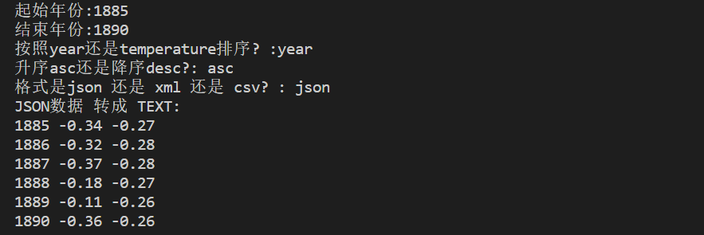
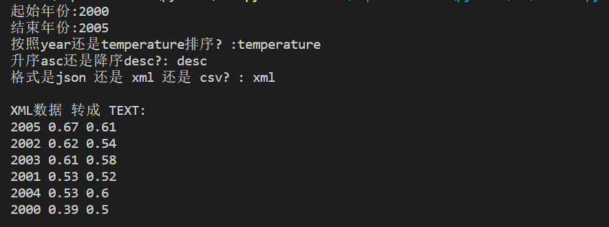
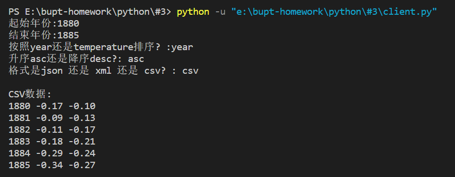

# Python程序设计#3作业

班级：2021211307

学号：2021211138

姓名：陈朴炎

## 1.1 作业题目
基于 aiohttp（https://docs.aiohttp.org/en/stable/） 实现一个服务查询客户端，能够访问#2作业提供的服务。数据获取后进行格式转换：
- JSON结果转换为TEXT格式（字段之间使用空格间隔、记录之间使用换行符间隔）
- XML结果转换为TEXT格式（需求同上）。
- CSV格式转换为TEXT格式（需求同上）。

要求客户端可以通过以上3种格式访问数据服务。

# 1.2 作业内容
```py
import aiohttp
import asyncio
import json
import xml.etree.ElementTree as ET

async def fetch_data(url, params):
    async with aiohttp.ClientSession() as session:
        async with session.get(url, params=params) as response:
            return await response.text()

def convert_json_to_text(json_data):
    # 转换JSON为TEXT格式
    data = json.loads(json_data)
    text_result = ""
    for entry in data:
        text_result += " ".join([str(value) for value in entry.values()]) + "\n"
    return text_result

def convert_xml_to_text(xml_data):
    root = ET.fromstring(xml_data)
    text_result = ""

    for entry in root.findall('.//entry'):
        year = entry.find('Year').text
        no_smoothing = float(entry.find('No_Smoothing').text)
        lowess = float(entry.find('Lowess(5)').text)

        text_result += f"{year} {no_smoothing:.2f} {lowess:.2f}\n"

    return text_result


def get_request():
    start_year = input("起始年份:")
    end_year = input("结束年份:")
    sort_by = input("按照year还是temperature排序? :")
    order = input("升序asc还是降序desc?: ")
    result_format = input("格式是json 还是 xml 还是 csv? : ")
    
    params = {
        'start_year': int(start_year),
        'end_year': int(end_year),
        'sort_by': sort_by,
        'order': order,
        'format': result_format
    }

    return params

async def main():
    url = 'http://localhost:8000'  

    # 获取用户输入的查询参数
    params = get_request()
    # 获取JSON数据并转换为TEXT格式
    if params['format'] == 'json':
        json_data = await fetch_data(url, params)
        print("JSON数据 转成 TEXT:")
        text_json = convert_json_to_text(json_data)
        print(text_json)

    # 获取XML数据并转换为TEXT格式
    elif params['format'] == 'xml':
        xml_data = await fetch_data(url, params)
        print(xml_data)
        text_xml = convert_xml_to_text(xml_data)
        print("\nXML数据 转成 TEXT:")
        print(text_xml)

    # 获取CSV数据并转换为TEXT格式
    elif params['format'] == 'csv':
        csv_data = await fetch_data(url, params)
        print("\nCSV数据:")
        print(csv_data.replace(","," "))

if __name__ == '__main__':
    import asyncio
    asyncio.run(main())
```
## 1.3 代码说明
对于这一个函数
```py
async def fetch_data(url, params):
    async with aiohttp.ClientSession() as session:
        async with session.get(url, params=params) as response:
            return await response.text()
```
aiohttp.ClientSession(): 创建一个异步会话，用于执行异步的 HTTP 请求。with 语句确保在退出块时正确释放会话资源。\
session.get(url, params=params): 使用指定的 url 和给定的参数 (params) 发起异步 GET 请求。比如说params = http://127.0.0.1:8000/?start_year=1880&end_year=1881&format=xml \
response.text(): 异步获取响应的文本内容。\
函数返回响应的文本内容。

对于这两个函数：
```py
def convert_json_to_text(json_data):
    # 转换JSON为TEXT格式
    data = json.loads(json_data)
    text_result = ""
    for entry in data:
        text_result += " ".join([str(value) for value in entry.values()]) + "\n"
    return text_result

def convert_xml_to_text(xml_data):
    root = ET.fromstring(xml_data)
    text_result = ""

    for entry in root.findall('.//entry'):
        year = entry.find('Year').text
        no_smoothing = float(entry.find('No_Smoothing').text)
        lowess = float(entry.find('Lowess(5)').text)

        text_result += f"{year} {no_smoothing:.2f} {lowess:.2f}\n"

    return text_result

```
函数以从服务器发来的回应为参数，将文本内容提取，将json、xml格式的文件转换成TEXT格式，以空格分隔列，换行符分隔行

对于这一个函数
```py
def get_request():
    start_year = input("起始年份:")
    end_year = input("结束年份:")
    sort_by = input("按照year还是temperature排序? :")
    order = input("升序asc还是降序desc?: ")
    result_format = input("格式是json 还是 xml 还是 csv? : ")
    
    params = {
        'start_year': int(start_year),
        'end_year': int(end_year),
        'sort_by': sort_by,
        'order': order,
        'format': result_format
    }

    return params
```
函数让用户输入查询的内容及排序方式，将用户输入打包成json格式。\
之后就可以发给服务器进行询问。

在主函数中，先是筛选了查询的格式信息，分别对返回结果处理，将返回结果转陈TEXT文件进行展示。

## 1.4 运行结果


<div style="text-align:center">
    图1-1 json结果
</div>
\



<div style="text-align:center">
    图1-2 xml结果
</div>
\



<div style="text-align:center">
    图1-3 csv结果
</div>