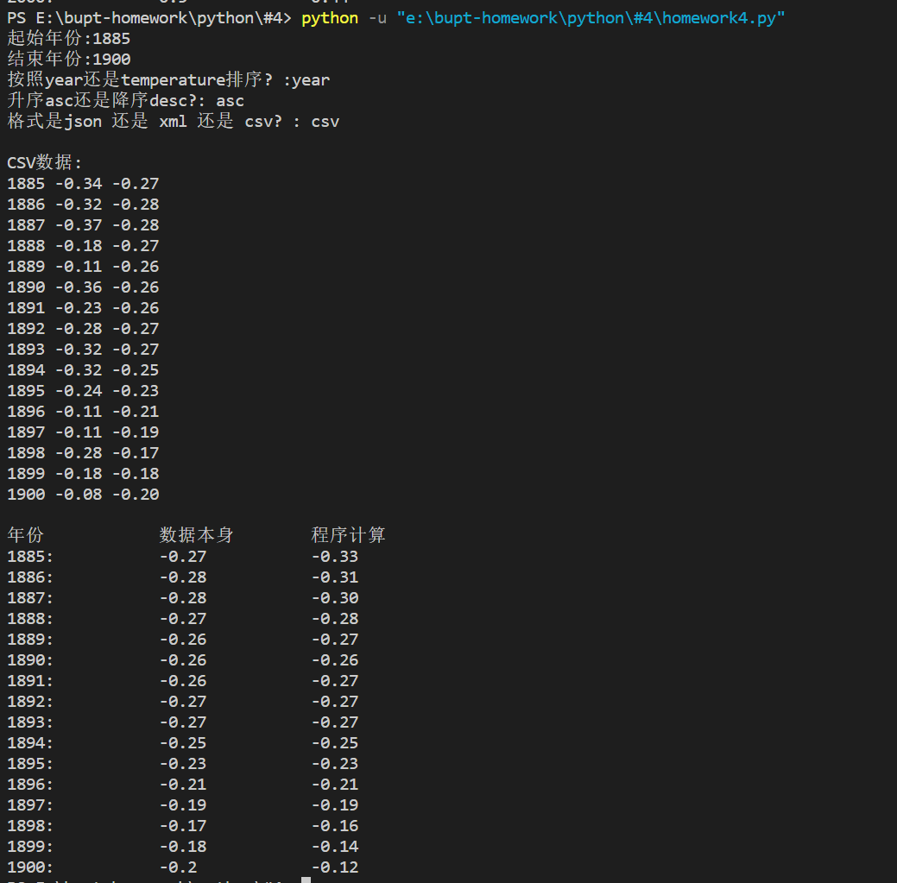

# 1 Python程序设计#4作业
班级：2021211307

学号：2021211138

姓名：陈朴炎

## 1.1 作业题目
基于#3作业获取的数据（No_Smoothing，非平滑数据），计算出LOWESS（局部加权回归，fraction取
前后各5年的数据）结果，该结果可以与#2作业中提供的graph.txt文件中的Lowess字段进行比较。

## 1.2 作业内容
代码嵌入到下方code block中
```py
import aiohttp
import asyncio
import json
import xml.etree.ElementTree as ET
import statsmodels.api as sm

async def fetch_data(url, params):
    async with aiohttp.ClientSession() as session:
        async with session.get(url, params=params) as response:
            return await response.text()

def convert_json_to_text(json_data):
    # 转换JSON为TEXT格式
    data = json.loads(json_data)
    text_result = ""
    for entry in data:
        text_result += " ".join([str(value) for value in entry.values()]) + "\n"
    return text_result

def convert_xml_to_text(xml_data):
    root = ET.fromstring(xml_data)
    text_result = ""

    for entry in root.findall('.//entry'):
        year = entry.find('Year').text
        no_smoothing = float(entry.find('No_Smoothing').text)
        lowess = float(entry.find('Lowess(5)').text)

        text_result += f"{year} {no_smoothing:.2f} {lowess:.2f}\n"

    return text_result


def get_request():
    start_year = input("起始年份:")
    end_year = input("结束年份:")
    sort_by = input("按照year还是temperature排序? :")
    order = input("升序asc还是降序desc?: ")
    result_format = input("格式是json 还是 xml 还是 csv? : ")
    
    params = {
        'start_year': int(start_year),
        'end_year': int(end_year),
        'sort_by': sort_by,
        'order': order,
        'format':result_format
    }

    return params

def calculate_lowess(data, fraction = 0.2):
    years = [entry['Year'] for entry in data]
    no_smoothing = [entry['No_Smoothing'] for entry in data]

    lowess = sm.nonparametric.lowess(no_smoothing, years, frac=fraction)

    return lowess[:, 1]

async def main():
    url = 'http://localhost:8000'  # 你的服务端地址

    # 获取用户输入的查询参数
    params = get_request()
    data = ""
    # 获取JSON数据并转换为TEXT格式
    if params['format'] == 'json':
        json_data = await fetch_data(url, params)
        print("\nJSON数据 转成 TEXT:")
        text_json = convert_json_to_text(json_data)
        data = text_json
        print(text_json)

    # 获取XML数据并转换为TEXT格式
    elif params['format'] == 'xml':
        xml_data = await fetch_data(url, params)
        print(xml_data)
        text_xml = convert_xml_to_text(xml_data)
        print("\nXML数据 转成 TEXT:")
        print(text_xml)
        data = text_xml

    # 获取CSV数据并转换为TEXT格式
    elif params['format'] == 'csv':
        csv_data = await fetch_data(url, params)
        print("\nCSV数据:")
        text_csv = csv_data.replace(","," ")
        print(text_csv)
        data = text_csv

    # 计算lowess
    data_list = [line.split(" ") for line in data.split("\n")]
    year_list = []
    no_smoothing_list = []
    lowess_list = []
    for entry in data_list:
        if len(entry) == 3:
            year_list.append(int(entry[0]))
            no_smoothing_list.append(float(entry[1]))
            lowess_list.append(float(entry[2]))
    lowess = sm.nonparametric.lowess(no_smoothing_list, year_list, frac= 10/len(year_list))
    print("年份\t\t数据本身\t程序计算")
    for i in range(len(lowess)):
        print("{}:\t\t{}\t\t{:.2f}".format(year_list[i], lowess_list[i], lowess[i][1]))


if __name__ == '__main__':
    asyncio.run(main())
```

## 1.3 代码说明
本次作业基于 #3 作业进行添加，重复内容不作说明，主要针对#4增加内容进行说明。
```py
def calculate_lowess(data, fraction = 0.2):
    years = [entry['Year'] for entry in data]
    no_smoothing = [entry['No_Smoothing'] for entry in data]
    lowess = sm.nonparametric.lowess(no_smoothing, years, frac=fraction)
    return lowess[:, 1]
```
这段代码将fraction默认为0.2，首先将year和no_smoothing值提取处理放到列表中，代表拟合函数的X和Y，之后调用sm.nonparametric.lowess，将no_smothing传入作为y，years传入作为x，将拟合参数fraction传入，如果要取前后5年的数据作为拟合数据，则要传入 10/len(years) 作为拟合参数fraction。最后返回了拟合后离散函数x, y

```py
    # 计算lowess
    data_list = [line.split(" ") for line in data.split("\n")]
    year_list = []
    no_smoothing_list = []
    lowess_list = []
    for entry in data_list:
        if len(entry) == 3:
            year_list.append(int(entry[0]))
            no_smoothing_list.append(float(entry[1]))
            lowess_list.append(float(entry[2]))
    lowess = sm.nonparametric.lowess(no_smoothing_list, year_list, frac= 10/len(year_list))
    print("年份\t\t数据本身\t程序计算")
    for i in range(len(lowess)):
        print("{}:\t\t{}\t\t{:.2f}".format(year_list[i], lowess_list[i], lowess[i][1]))
```
这段代码先将数据从文本信息中剥离，将year、no_smoothing和数据原来的lowess提取处理，之后将no_smoothing_list和year_list，以及frac=10/(len(year_list))传入到计算lowess的函数中，返回每个year对应的lowess，其中，10/len(year_list)表示取前后各5年的数据进行拟合。
## 1.4 运行结果及分析
### 1.4.1 1885-1900 计算结果及比较

<div style="text-align:center">
    图1-1 1885-1900 运行结果
</div>
分析：

图片上半部分是#3作业的输出，下半部分是计算Lowess和原始数据里的Lowess的比较。左侧这一列是数据本身给的Lowess，而右边这一列是我程序计算的。可以看到，由于我计算的时候给的是从服务器获取的数据，而我的fraction取的是前后5年的，所以在计算的前5年和后5年数据和原来的数据有些许偏差，而中间的其他年份计算的相同。

### 1.4.2 1900-2000 计算结果及比较

<div style="text-align:center">
    图1-2 1885-1900 运行结果
</div>


<div style="text-align:center">
    图1-3 1885-1900 运行结果
</div>
分析：

同样的可以看到，由于我计算的时候给的是从服务器获取的数据，而我的fraction取的是前后5年的，所以在计算的前5年和后5年数据和原来的数据有些许偏差，而中间的其他年份计算的相同。基本上来看计算结果和给出的结果是一样的。

