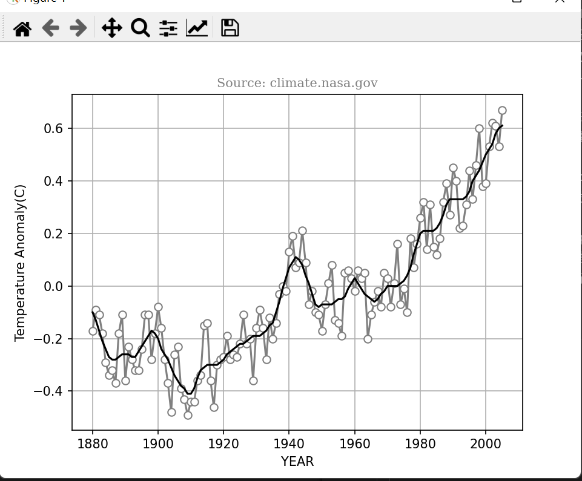
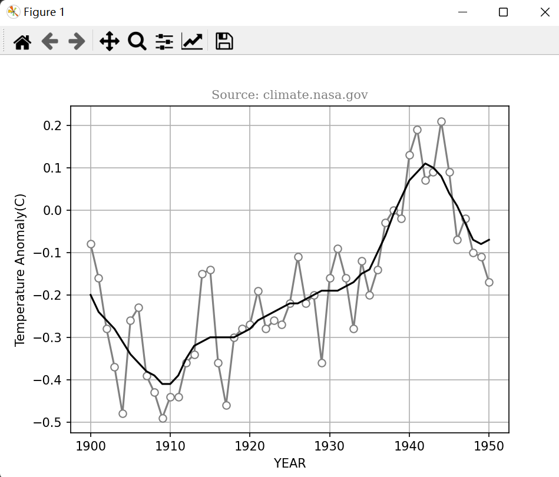
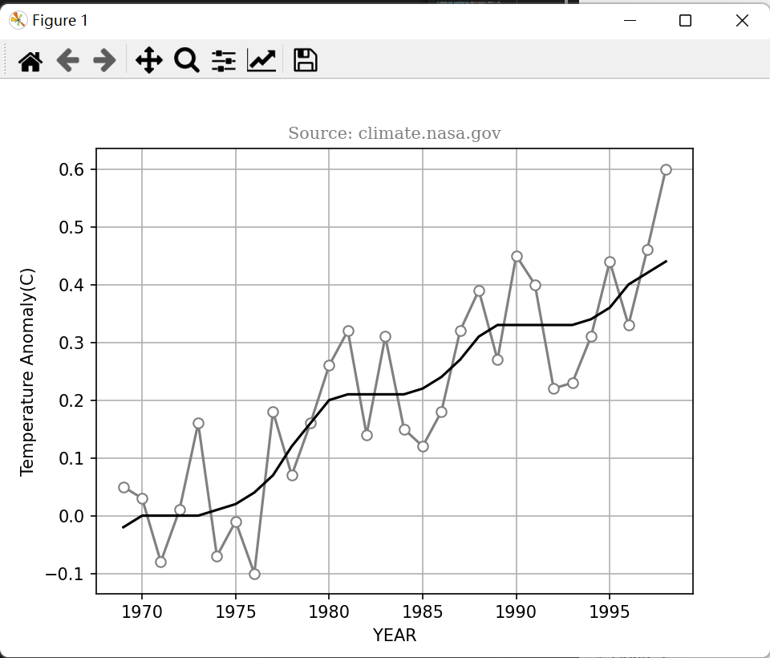

# 1 Python程序设计#5作业
班级：2021211307

学号：2021211138

姓名：陈朴炎
## 1.1 作业题目
基于#3作业、#4作业获取的No_Smoothing、Lowess数据项，在同一个图上分别绘制出折线图
（No_Smoothing）和平滑线图（Lowess）。绘制结果对照参考图片（test.png）。
## 1.2 作业内容
```py
import aiohttp
import asyncio
import json
import statsmodels.api as sm
import matplotlib.pyplot as plt
import numpy as np

async def fetch_data(url, params):
    async with aiohttp.ClientSession() as session:
        async with session.get(url, params=params) as response:
            return await response.text()

def convert_json_to_text(json_data):
    # 转换JSON为TEXT格式
    data = json.loads(json_data)
    text_result = ""
    for entry in data:
        text_result += " ".join([str(value) for value in entry.values()]) + "\n"
    return text_result

def convert_xml_to_text(xml_data):
    text_result = ""
    lines = xml_data.split("\n")
    for line in lines:
        line = line.strip()
        if line.startswith("<Year>"):
            line = line.replace("<Year>", "").replace("</Year>", "")
            text_result += f"{line} "
        elif line.startswith("<No_Smoothing>"):
            line = line.replace("<No_Smoothing>", "").replace("</No_Smoothing>", "")
            text_result += f"{line} "
        elif line.startswith("<Lowess(5)>"):
            line = line.replace("<Lowess(5)>", "").replace("</Lowess(5)>", "")
            text_result += f"{line}\n"

    return text_result


def get_request():
    start_year = input("起始年份:")
    end_year = input("结束年份:")
    sort_by = input("按照year还是temperature排序? :")
    order = input("升序asc还是降序desc?: ")
    result_format = input("格式是json 还是 xml 还是 csv? : ")
    
    params = {
        'start_year': int(start_year),
        'end_year': int(end_year),
        'sort_by': sort_by,
        'order': order,
        'format':result_format
    }

    return params

def calculate_lowess(data, fraction = 0.2):
    years = [entry['Year'] for entry in data]
    no_smoothing = [entry['No_Smoothing'] for entry in data]

    lowess = sm.nonparametric.lowess(no_smoothing, years, frac=fraction)

    return lowess[:, 1]


async def main():
    url = 'http://localhost:8000'  # 你的服务端地址

    # 获取用户输入的查询参数
    params = get_request()
    data = ""
    # 获取JSON数据并转换为TEXT格式
    if params['format'] == 'json':
        json_data = await fetch_data(url, params)
        print("\nJSON数据 转成 TEXT:")
        text_json = convert_json_to_text(json_data)
        data = text_json
        print(text_json)

    # 获取XML数据并转换为TEXT格式
    elif params['format'] == 'xml':
        xml_data = await fetch_data(url, params)
        print(xml_data)
        text_xml = convert_xml_to_text(xml_data)
        print("\nXML数据 转成 TEXT:")
        print(text_xml)
        data = text_xml

    # 获取CSV数据并转换为TEXT格式
    elif params['format'] == 'csv':
        csv_data = await fetch_data(url, params)
        print("\nCSV数据:")
        text_csv = csv_data.replace(","," ")
        print(text_csv)
        data = text_csv

    # 作业4 计算lowess
    data_list = [line.split(" ") for line in data.split("\n")]
    year_list = []
    no_smoothing_list = []
    lowess_list = []
    for entry in data_list:
        if len(entry) == 3:
            year_list.append(int(entry[0]))
            no_smoothing_list.append(float(entry[1]))
            lowess_list.append(float(entry[2]))
    lowess = sm.nonparametric.lowess(no_smoothing_list, year_list, frac= 10/len(year_list))
    print("年份\t\t数据本身\t程序计算")
    for i in range(len(lowess)):
        print("{}:\t\t{}\t\t{:.2f}".format(year_list[i], lowess_list[i], lowess[i][1]))

    # 作业5
    # 将数据转换成numpy
    year_array = np.array(year_list)
    no_smoothing_array = np.array(no_smoothing_list)
    lowess_array = np.array(lowess_list)

    plt.plot(year_array, no_smoothing_array, label='No_Smoothing', marker='o', mec = 'gray', markerfacecolor='w', linestyle='-', color='gray')
    plt.plot(year_array, lowess_array, label='Lowess', color='k')
    plt.xlabel('YEAR')
    plt.ylabel('Temperature Anomaly(C)')
    font1 = {'family':'serif', 'color':'gray', 'size':10}
    plt.title("Source: climate.nasa.gov", fontdict=font1)
    plt.grid(True)
    plt.show()


if __name__ == '__main__':
    asyncio.run(main())
```

## 1.3 代码说明
本次作业在#3、#4的基础上添加了以下代码
```py
    # 作业5
    # 将数据转换成numpy
    year_array = np.array(year_list)
    no_smoothing_array = np.array(no_smoothing_list)
    lowess_array = np.array(lowess_list)

    plt.plot(year_array, no_smoothing_array, label='No_Smoothing', marker='o', mec = 'gray', markerfacecolor='w', linestyle='-', color='gray')
    plt.plot(year_array, lowess_array, label='Lowess', color='k')

    plt.xlabel('YEAR')
    plt.ylabel('Temperature Anomaly(C)')
    font1 = {'family':'serif', 'color':'gray', 'size':10}
    plt.title("Source: climate.nasa.gov", fontdict=font1)

    plt.grid(True)
    plt.show()
```
1. 将数据转换为对应的 NumPy 数组：\
    year_array: 包含年份数据的 NumPy 数组。\
    no_smoothing_array: 包含 No_Smoothing 数据的 NumPy 数组。\
    lowess_array: 包含 Lowess 数据的 NumPy 数组。
2.  绘制数据线\
    将No_smoothing数据绘制成折线段，Lowess数据绘制成平滑线段。\
    其中，marker 参数设置了数据点的样式，使用灰色空心圆表示 No_Smoothing，使用黑色实心圆表示 Lowess。\
    mec 和 markerfacecolor 分别设置了空心圆的边缘颜色和填充颜色。\
    linestyle 和 color 设置了线的样式和颜色。
3. 添加标签\
    使用 plt.xlabel() 和 plt.ylabel() 添加 x 轴和 y 轴的标签。\
    使用 plt.title() 添加图表的标题。
4. 加上网格线，并显示\
    plt.grid(True)是加上网格线\
    plt.show()是显示绘制好的图表。


## 1.4 效果展示

<div style="text-align:center">
    图1-1 1880-2005 绘制图
</div>
<br></br>



<div style="text-align:center">
    图1-2 1900-1950 绘制图
</div>
<br></br>


<div style="text-align:center">
    图1-3 1969-1998 绘制图
</div>
<br></br>