# 1 Python程序设计-大作业

班级：2021211307

学号：2021211138

姓名：陈朴炎

## 1.1 作业题目
### 1.1.1 数据
gpw-v4-population-count-rev11_2020_30_sec_asc.zip是一个全球人口分布数据压缩文件，解压后包括了8个主要的asc后缀文件，他们是全球网格化的人口分布数据文件，这些文件分别是：

    · gpw-v4-population-count-rev11_2020_30_sec_1.asc
    · gpw-v4-population-count-rev11_2020_30_sec_2.asc
    · gpw-v4-population-count-rev11_2020_30_sec_3.asc
    · gpw-v4-population-count-rev11_2020_30_sec_4.asc
    · gpw-v4-population-count-rev11_2020_30_sec_5.asc
    · gpw-v4-population-count-rev11_2020_30_sec_6.asc
    · gpw-v4-population-count-rev11_2020_30_sec_7.asc
    · gpw-v4-population-count-rev11_2020_30_sec_8.asc

这些文件分布对应地球不同经纬度的范围。

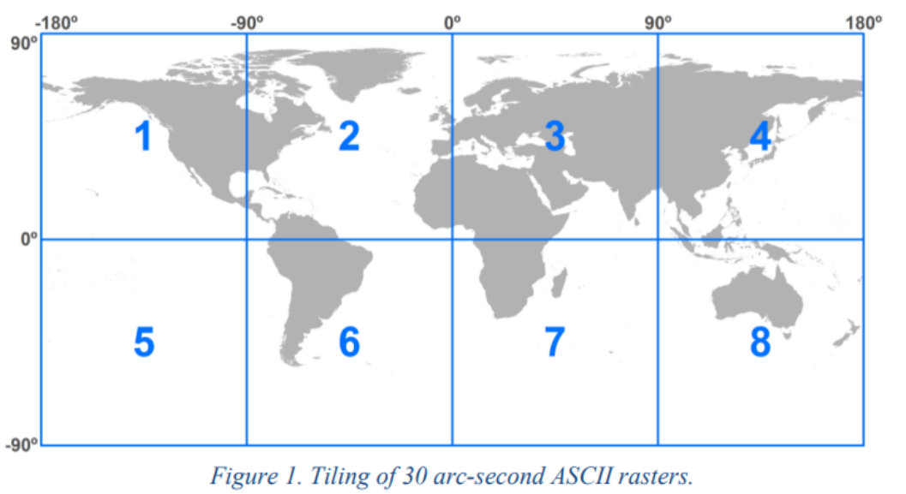
<div style="text-align:center">
    图1-1 数据文件-地理位置示意图
</div>

压缩文件下载网页：https://sedac.ciesin.columbia.edu/data/set/gpw-v4-population-count-rev11/data-download

### 1.1.2 服务端

压缩文件（gpw-v4-population-count-rev11_2020_30_sec_asc.zip）是一个全球人口分布数据。基于Sanic实现一个查询服务，服务包括：

    · 按给定的经纬度范围查询人口总数，查询结果采用JSON格式。
    · 不可以采用数据库，只允许使用文件方式存储数据。
    · 可以对现有数据进行整理以便加快查询速度，尽量提高查询速度。

查询参数格式 采用GeoJSON（https://geojson.org/）的多边形（每次只需要查询一个多边形范围，只需要支持凸多边形）

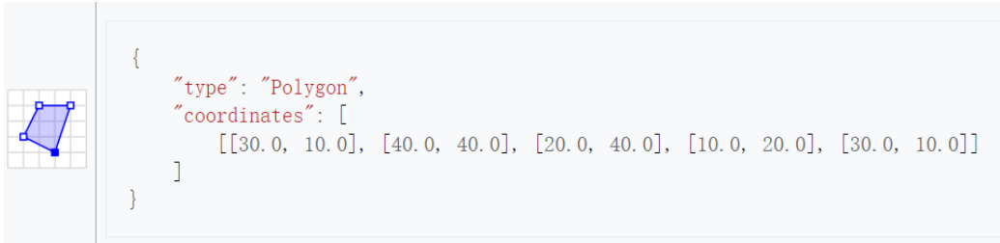
<div style="text-align:center">
    图1-2 查询参数示意图
</div>

### 1.1.3 服务端

针对上面的查询服务，实现一个服务查询客户端，数据获取后使用Matplotlib散点图（Scatter）进行绘制。

    · 横坐标（x轴）为经度。
    · 纵坐标（y轴）为维度。

## 1.2 服务端代码
### 1.2.1 数据预处理程序
```py
import numpy as np
from shapely.geometry import shape, Polygon

def pool_file(file_path, file_type="txt"):
    invalid_value = -9999
    if file_type == 'txt':
        input_array = np.loadtxt(file_path, skiprows=6)
    elif file_type == 'npy':
        input_array = np.load(file_path)
    input_array [input_array == invalid_value] = np.nan
    # 池化，四变一
    result_array = np.zeros((input_array.shape[0] // 2, input_array.shape[1] // 2))

    # 横纵步长为1，提取特征
    for i in range(0, input_array.shape[0], 2):
        for j in range(0, input_array.shape[1], 2):
            block = input_array[i:i+2, j:j+2]
            # 计算均值时忽略 NaN 值
            if np.any(~np.isnan(block)):
                result_array[i // 2, j // 2] = np.nansum(block)
    return result_array


def convert_file():
    base_path = "D:\下载/gpw-v4-population-count-rev11_2020_30_sec_asc/"
    for i in range(1, 9):
        file_path = base_path+"gpw_v4_population_count_rev11_2020_30_sec_"+str(i)+".asc"
        result_data = pool_file(file_path)
        np.save("./data/pool_1_"+str(i)+".npy", result_data)
        print("{} ok".format(i))
        for j in range(1, 3):
            input_path = "./data/pool_"+str(j)+"_"+str(i)+".npy"
            pool_data = pool_file(input_path,"npy")
            output_path = "./data/pool_"+str(j+1)+"_"+str(i)+".npy"
            np.save(output_path, pool_data)
            print("{}, {}".format(i, j))


def read_data(file_path):
    ret_array = np.load(file_path)
    return ret_array

def get_data():
    data_list = []
    for i in range(1, 9):
        file_path = "../data/pool_4_"+str(i)+".npy"
        data_list.append(read_data(file_path))
    
    return np.concatenate([np.concatenate(data_list[:4], axis=1), np.concatenate(data_list[4:], axis=1)], axis=0)


if __name__ == "__main__":
    
    convert_file()
```
#### 1.2.1.2 数据预处理程序说明
数据预处理的核心是下面这个函数
```py
def pool_file(file_path, file_type="txt"):
    invalid_value = -9999
    if file_type == 'txt':
        input_array = np.loadtxt(file_path, skiprows=6)
    elif file_type == 'npy':
        input_array = np.load(file_path)
    input_array [input_array == invalid_value] = np.nan
    # 池化，四变一
    result_array = np.zeros((input_array.shape[0] // 2, input_array.shape[1] // 2))

    # 横纵步长为1，提取特征
    for i in range(0, input_array.shape[0], 2):
        for j in range(0, input_array.shape[1], 2):
            block = input_array[i:i+2, j:j+2]
            # 计算均值时忽略 NaN 值
            if np.any(~np.isnan(block)):
                result_array[i // 2, j // 2] = np.nansum(block)
    return result_array
```
一开始我在读取数据的时候发现，数据量特别大，要将所有数据读取到程序中的话，占用非常多的内存资源，如果想在程序中对数据进行变化的话，会使我的内存爆炸。因此，我选择将数据压缩。

数据压缩的思路有点类似池化，但是我是在每一轮数据提取中取出每个pool的总和，放到新的位置中。在第一轮中一个 2 * 2 的pool将被转换成 1 * 1 的大小，例如：

    [
        [1,1,1,1],
        [2,2,2,2],
        [3,3,3,3],
        [4,4,4,4]
    ]
    上面这个np数组，它的左上角
    [
        [1,1],
        [2,2]
    ]
    将被提取成一个数字6，同理，它的右上角将被提取成一个数字6，左下角变成14，右下角变成14，压缩后的数据就变成如下形式：
    [
        [6 ,6 ],
        [14,14]
    ]
    由一个 4 * 4 大小的矩阵变成了一个 2 * 2 大小的矩阵。这样，一轮就压缩成了原来的四分之一。

为了更加节省空间，我在数据处理完之后给它存成了numpy的二进制形式，因此有了开头的 ```elif file_type == 'npy' ``` ，这是为了处理二进制数据的。

```input_array [input_array == invalid_value] = np.nan```   这条语句将所有数值为-9999的无效数据都转换成了np.nan这个无效数据

```result_array = np.zeros((input_array.shape[0] // 2, input_array.shape[1] // 2))```  这里我初始化了一个大小为原来四分之一大小的numpy数组，用来存放转换后的数据结果。
```py
# 横纵步长为1，提取特征
    for i in range(0, input_array.shape[0], 2):
        for j in range(0, input_array.shape[1], 2):
            block = input_array[i:i+2, j:j+2]
            # 计算均值时忽略 NaN 值
            if np.any(~np.isnan(block)):
                result_array[i // 2, j // 2] = np.nansum(block)
```
这里，我每次读取 2 * 2 大小的数据块，忽略掉无效的信息，并计算它们的总和，放到新的位置。
最后返回转换后的结果。

```py
def convert_file():
    base_path = "D:\下载/gpw-v4-population-count-rev11_2020_30_sec_asc/"
    for i in range(1, 9):
        file_path = base_path+"gpw_v4_population_count_rev11_2020_30_sec_"+str(i)+".asc"
        result_data = pool_file(file_path)
        np.save("./data/pool_1_"+str(i)+".npy", result_data)
        print("{} ok".format(i))
        for j in range(1, 3):
            input_path = "./data/pool_"+str(j)+"_"+str(i)+".npy"
            pool_data = pool_file(input_path,"npy")
            output_path = "./data/pool_"+str(j+1)+"_"+str(i)+".npy"
            np.save(output_path, pool_data)
            print("{}, {}".format(i, j))
```
这个函数是用来多次迭代压缩数据的，每次读取上一次转换完的数据，并进行下一次转换，这样经过四次转换，10800 * 10800 大小的数据就会变成 675 * 675 大小的数据，数据量压缩成了 16 * 16 = 256分之一。压缩过后的八个文件大小如下所示: 

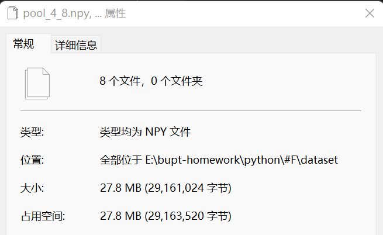

<div style="text-align:center">
    图2-1 压缩后数据大小示意图
</div>
<br>

```py
def get_data():
    data_list = []
    for i in range(1, 9):
        file_path = "../data/pool_4_"+str(i)+".npy"
        data_list.append(read_data(file_path))
    
    return np.concatenate([np.concatenate(data_list[:4], axis=1), np.concatenate(data_list[4:], axis=1)], axis=0)
```
这个函数是供外部函数调用的，用来获取处理好的数据，这里我选择第四次转换后的数据进行读取，一次性将八个文件读取完后，就将前四个数组列扩展，后四个数组列扩展，再将列扩展后的数组行扩展，得到一个对应世界经纬度的数组。


### 1.2.2 服务端程序
```py
from sanic import Sanic
import read_file as rf
from sanic.response import json
from shapely.geometry import Polygon, shape

app = Sanic(__name__)
data = rf.get_data()
cellsize = 1.0/7.5
@app.post("/population")
async def query_population(request):
    try:
        req = request.json
        geojson_data = req['geojson']
        req_polygon = shape(geojson_data)

        # 执行查询
        total_population, min_col, max_col, min_row, max_row = get_population_in_polygon(data, req_polygon)
        ret_data = data[min_row:max_row+1, min_col:max_col+1]

        return json({
                "total_population": total_population,
                "dtype" : str(ret_data.dtype),
                "data": ret_data.tolist(),  
                "shape": ret_data.shape
        })
    except Exception as e:
        return json({"error": str(e)})
    

def get_population_in_polygon(data, polygon):
    # 将 GeoJSON 多边形坐标转换为网格坐标
    min_lon, min_lat, max_lon, max_lat = polygon.bounds

    min_col = int((min_lon + 180) / cellsize)
    max_col = int((max_lon + 180) / cellsize)
    min_row = int((90 - max_lat) / cellsize)
    max_row = int((90 - min_lat) / cellsize)

    # 遍历多边形所包含的所有网格
    total_population = 0

    for row in range(min_row, max_row + 1):
        for col in range(min_col, max_col + 1):
            # 计算网格与多边形相交部分的面积
            grid_coords = (row, col)
            grid_polygon = get_polygon_from_grid_coords(grid_coords, cellsize)
            intersection_area = grid_polygon.intersection(polygon).area

            # 根据网格列表获取相应的人口数据
            grid_population = data[row, col]

            # 根据面积比例调整人口数据
            adjusted_population = grid_population * (intersection_area / grid_polygon.area)
            
            total_population += adjusted_population

    return total_population, min_col, max_col, min_row, max_row


def get_polygon_from_grid_coords(grid_coords, cellsize):
    # 获取网格的多边形
    row, col = grid_coords
    min_lon = col * cellsize - 180
    max_lon = (col + 1) * cellsize - 180
    min_lat = 90 - (row + 1) * cellsize
    max_lat = 90 - row * cellsize

    polygon = Polygon([
        (min_lon, min_lat),
        (max_lon, min_lat),
        (max_lon, max_lat),
        (min_lon, max_lat),
        (min_lon, min_lat)
    ])

    return polygon

if __name__ == "__main__":
    app.run(host="localhost", port=8000)
```
#### 1.2.2.1 服务端代码说明
服务端的主体逻辑较为简单，当客户端发来POST查询请求的时候，服务端解析这个POST报文，并获取查询的多边形坐标。
```py
@app.post("/population")
async def query_population(request):
    try:
        req = request.json
        geojson_data = req['geojson']
        req_polygon = shape(geojson_data)

        # 执行查询
        total_population, min_col, max_col, min_row, max_row = get_population_in_polygon(data, req_polygon)
        ret_data = data[min_row:max_row+1, min_col:max_col+1]

        return json({
                "total_population": total_population,
                "dtype" : str(ret_data.dtype),
                "data": ret_data.tolist(),  
                "shape": ret_data.shape
        })
    except Exception as e:
        return json({"error": str(e)})
```
服务端会把这个geojson格式用shape函数变成一个Polygon对象，然后将该对象传到 get_population_in_polygon 函数中，获取这个多边形所对应的外界矩阵数据，以及外接矩阵的坐标，还有对应的人口总数。然后将相应的矩阵数据序列化，并回应给客户端。

查询的结果是总人口数以及对应的多边形外接矩阵的数据，服务端会将它们封装成一个POST报文回应给客户端。为了能够将二维的numpy数组封装到报文中，我将data数据序列化，并传回data的数据类型，data的形状，使得客户端可以通过这个data数据重新reshape出二维数组。

在get_population_in_polygon函数中，首先通过``` min_lon, min_lat, max_lon, max_lat = polygon.bounds ```这一行获取polygon的外边界，它代表polygon的外接矩形每个顶点的经纬度坐标。

```py
    min_col = int((min_lon + 180) / cellsize)
    max_col = int((max_lon + 180) / cellsize)
    min_row = int((90 - max_lat) / cellsize)
    max_row = int((90 - min_lat) / cellsize)
```
之后，计算这些坐标所对应到数据数组中的行列索引值

```py
def get_polygon_from_grid_coords(grid_coords, cellsize):
    # 获取网格的多边形
    row, col = grid_coords
    min_lon = col * cellsize - 180
    max_lon = (col + 1) * cellsize - 180
    min_lat = 90 - (row + 1) * cellsize
    max_lat = 90 - row * cellsize

    polygon = Polygon([
        (min_lon, min_lat),
        (max_lon, min_lat),
        (max_lon, max_lat),
        (min_lon, max_lat),
        (min_lon, min_lat)
    ])

    return polygon
```
这个函数是用来查询数据对应的多边形。首先传入网格信息，以及每个网格的大小，通过网格的行列索引值来得到每个网格边界的经纬度，之后用这个经纬度来构建多边形，用来和查询的多边形对比。

```py
    grid_coords = (row, col)
    grid_polygon = get_polygon_from_grid_coords(grid_coords,cellsize)
    intersection_area = grid_polygon.intersection(polygon).area
```
在查询总人口的函数中，通过计算出的行列索引范围，程序遍历数据对应的每个栅格，计算查询的多边形和该栅格的重叠面积。
```py
    adjusted_population = grid_population * (intersection_area / grid_polygon.area)
    total_population += adjusted_population
```
通过重叠面积的百分比来计算对应的人数，并加到总人数里。

## 1.3 客户端代码
```py
import requests
import json
from shapely.geometry import shape
import numpy as np
import matplotlib.pyplot as plt
from matplotlib.colors import LogNorm
from matplotlib.path import Path
from matplotlib.patches import PathPatch


def query_server(geojson):
    url = "http://localhost:8000/population"
    data = {"geojson":geojson}
    headers = {"Content-Type": "application/json"}
    server_res = requests.post(url, data=json.dumps(data), headers=headers)
    if not server_res.status_code == 200:
        print("Error:", server_res.status_code)
        return None, None
    
    res_data = server_res.json()
    print(res_data)
    population = res_data["total_population"]
    data_list = res_data["data"] 
    data_dtype = np.dtype(res_data["dtype"])
    data_shape = res_data["shape"]
    data = np.array(data_list, dtype=data_dtype).reshape(data_shape)
    
    return data, population


def draw_map_scatter(data, polygon, total_population):
    min_lon, min_lat, max_lon, max_lat = polygon.bounds

    polygon_path = Path(np.array(polygon.exterior.coords))
    
    # 绘制地图
    fig, ax = plt.subplots(figsize=(10, 5))
    
    # 获取散点坐标
    lon, lat = np.meshgrid(np.linspace(min_lon, max_lon, data.shape[1]), np.linspace(min_lat, max_lat, data.shape[0])[::-1])


    # 将数据展平为一维数组
    data_flat = data.flatten()
    ax.set_xlim(min_lon, max_lon)
    ax.set_ylim(min_lat, max_lat)
    # 使用Scatter散点图
    sc = ax.scatter(lon.flatten(), lat.flatten(), c=data_flat, cmap='coolwarm', norm=LogNorm(), s=3, edgecolors='none')
    
    # 使用 PathPatch 绘制多边形并设置为透明
    patch = PathPatch(polygon_path, facecolor='none')
    ax.add_patch(patch)

    # 设置多边形内部为透明
    sc.set_clip_path(patch)
    
    # 添加颜色条
    plt.colorbar(sc, ax=ax, label='Population', ticks=[10, 100, 1000, 10000, 100000], format='%.0f')

    ax.set_title('Population Distribution: {:.0f}'.format(total_population))
    ax.set_xlabel('Longitude')
    ax.set_ylabel('Latitude')
    plt.axis('equal')
    ax.grid(True)

    plt.show()


if __name__ == "__main__":
    geojson_polygon_1 = {
        "type": "Polygon",
        "coordinates": [
            [[30.0, 25.0], [40.0, 55.0], [20.0, 65.0], [10.0, 55.0], [30.0, 25.0]]
        ]
    }
    
    geojson_polygon_2 = {
        "type": "Polygon",
        "coordinates": [
            [[-157.6, 56.8], [-103.5, 40.0], [-120.2, 30.7], [-157.6, 56.8]]
        ]
    }

    geojson_polygon_3 = {
        "type": "Polygon",
        "coordinates": [
            [[80.0, 80.0], [-179.0, 0.0], [80.0, -80.0], [179.0, 0.0], [80.0, 80.0]]
        ]
    }

    geojson_polygon_4 = {
        "type": "Polygon",
        "coordinates": [
            [[105.3, 40.0], [122.0, 40.0], [121.0, 23.5], [105.3, 40.0]]
        ]
    }

    geojson_polygon_5 = {
        "type": "Polygon",
        "coordinates": [
            [[90.0, 45.0], [122.0, 40.0], [121.0, 23.5],[101.5, 30.0], [95.0, 38.5], [90.0, [45.0]]]
        ]
    }

    geojson_polygon_6 = {
        "type": "Polygon",
        "coordinates": [
            [[-70.0, 20.0], [-90.0, 0.0], [-70.0, -55.0],[-50.0, -45.0], [-30.0, -10.0], [-70.0, 20.0]]
        ]        
    }

    geojson_polygon_7 = {
        "type": "Polygon",
        "coordinates": [
            [[-179.0, 89.0], [-179.0, -89.0], [179.0, -89.0],[-179.0, 89.0]]
        ]
    }

    geojson_polygon_8 = {
        "type": "Polygon",
        "coordinates": [
            [[-179.0, 89.0], [-179.0, -89.0], [179.0, -89.0], [179.0, 89.0], [-179.0, 89.0]]
        ]
    }
    geojson_polygon_9 = {
        "type":"Polygon",
        "coordinates":[
            [[30.0,10.0],[40.0,10.0],[40.0,40.0],[30.0,40.0],[30.0,10.0]]
        ]
    }
    geojson_polygon = geojson_polygon_6
    polygon = shape(geojson_polygon)
    data, population = query_server(geojson=geojson_polygon)

    draw_map_scatter(data, polygon, population)
```

### 1.3.1 客户端代码说明
客户端的逻辑也不难，就是将查询的数据封装成json格式，通过POST发送给服务端。接着等待服务端返回的数据，根据总人口和返回的数据信息绘制相应的人口分布图。

```py
    res_data = server_res.json()
    print(res_data)
    population = res_data["total_population"]
    data_list = res_data["data"] 
    data_dtype = np.dtype(res_data["dtype"])
    data_shape = res_data["shape"]
    data = np.array(data_list, dtype=data_dtype).reshape(data_shape)
    
```
在服务端的主体函数中，首先获取服务端的数据。然后将该数据通过json格式解析出来，通过json键值对获取总人口数以及每个栅格的数据。由于服务器发来的数据是经过序列化过的，因此要将序列化的数据重新变为numpy数组。为了重构数组，服务器还会发送该数组的数据类型以及形状。在客户端中，通过服务端提供的信息将数据重构。


客户端还有一个重要的函数是画图函数。画图我采用了两个图层，思路是：

    1. 画出多边形外接矩阵的所有人口分布图，作为底层
    2. 多加一个图层，将多边形的边界画出来
    3. 将多边形内部区域设置成透明，这样能够看到底层的数据
    4. 多边形外部的区域设置为白色，遮挡住非查询区域

同时为了反应人口分布的多与少，我还设置了一个颜色条，人少的时候是蓝色，人多的时候是红色，呈现为冷暖渐进的颜色。

在图像中，我的标题包含了这个范围的人口总数。图像的横坐标是经度，纵坐标是纬度。数据中的无效数据用白色替代。

具体代码解释如下：
```py
    min_lon, min_lat, max_lon, max_lat = polygon.bounds

    polygon_path = Path(np.array(polygon.exterior.coords))

```
首先，通过polygon的bounds函数得到多边形外接矩阵的各个点坐标。\
并且通过Path函数得到多边形的外边界线。\
其中，参数说明如下：

    polygon.exterior.coords会返回多边形的外环坐标。如果用一个list来显示的话，效果如下：
    
        polygon = Polygon([(0, 0), (1, 0), (1, 1), (0, 1)])
        exterior_coords = list(polygon.exterior.coords)

                            ||
                            ||
                            \/

        [(0.0, 0.0), (1.0, 0.0), (1.0, 1.0), (0.0, 1.0), (0.0, 0.0)]
    
这里我将这个多边形外部的坐标组成一个numpy数组，传入Path中，这样就能得到多边形外环的边框线。

```py

    fig, ax = plt.subplots(figsize=(10, 5))
    
    
    lon, lat = np.meshgrid(np.linspace(min_lon, max_lon, data.shape[1]), np.linspace(min_lat, max_lat, data.shape[0])[::-1])
```
ax 可以看成是plt的画布，它的大小是长10，宽5\
创建出画布后，np.meshgrid 用于生成网格坐标矩阵，其中第一个参数是沿着横轴的坐标，第二个参数是沿着纵轴的坐标。生成的网格矩阵可以用于在坐标平面上表示二维数据。\
np.linspace(min_lon, max_lon, data.shape[1]): 这部分生成了经度（Longitude）的坐标，使用 np.linspace 在最小经度和最大经度之间均匀生成 data.shape[1] 个点。\
np.linspace(min_lat, max_lat, data.shape[0])[::-1]: 这部分生成了纬度（Latitude）的坐标，同样使用 np.linspace 在最小纬度和最大纬度之间均匀生成 data.shape[0] 个点。 由于获取出来的纬度我要从小到大排列（原始数据是反过来的），所以需要将获得的纬度列表反转一下。[::-1] 表示将生成的纬度坐标进行反转，即从最大纬度到最小纬度。\
这样，lon 和 lat 分别是二维网格坐标矩阵，用于表示对应位置的经度和纬度，经过实验，这样可以确保数据正确地映射到地图上。

```py

    data_flat = data.flatten()
    ax.set_xlim(min_lon, max_lon)
    ax.set_ylim(min_lat, max_lat)
    
    sc = ax.scatter(lon.flatten(), lat.flatten(), c=data_flat, cmap='coolwarm', norm=LogNorm(), s=3, edgecolors='none')
```
构建好坐标数值后，我开始构建散点图。首先散点图要传入横纵坐标，以及对应的一维数据。所以需要将数据扁平化处理，这里用到了flatten()函数，是numpy的内置函数，同理，也要对经纬度数据进行处理。cmap是颜色到数据的对应，我选择冷暖对应，越蓝代表人越少，越红代表人越多。\
norm对象用来规范颜色数值的对应关系。s是散点的大小，这里我测试了几个值，10太大了，1太小，选择3，虽然有一些空白，但是看得会很直观。同时把边界线颜色置为空。

```py

    patch = PathPatch(polygon_path, facecolor='none')
    ax.add_patch(patch)

    
    sc.set_clip_path(patch)
```
这里，我先用PathPatch函数得到多边形外环的路径，得到了多边形在图上的位置和范围。之后在之前画好的图层上再画一个图层。使用set_clip_path把多边形内部的区域设置为透明，这样就能很好的将多边形的区域数据散点图展示出来，并把多边形外的散点区域遮蔽住。

```py
    plt.colorbar(sc, ax=ax, label='Population', ticks=[10, 100, 1000, 10000, 100000], format='%.0f')

    ax.set_title('Population Distribution: {:.0f}'.format(total_population))
    ax.set_xlabel('Longitude')
    ax.set_ylabel('Latitude')
    plt.axis('equal')
    ax.grid(True)

    plt.show()
```
最后，在图上添加上颜色条，数值过渡为每个数量级一个类型的颜色。\
在标题上显示出总人口数量，并将横纵坐标的标题展示出来。\
为了能够解决散点图自动拉伸图像的问题，我使用plt.axis('equal')将横纵坐标的标度设成相同的值。


## 1.4 运行结果

测试用例1
    
    geojson_polygon_1 = {
        "type": "Polygon",
        "coordinates": [
            [[30.0, 10.0], [40.0, 40.0], [20.0, 40.0], [10.0, 20.0], [30.0, 10.0]]
        ]
    }
运行结果

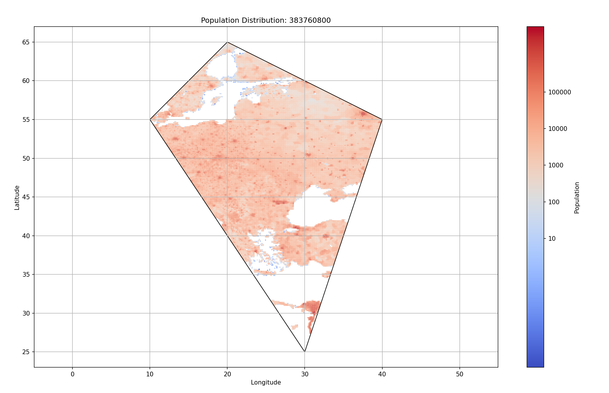
<div style="text-align:center">
    图4-1 查询结果图1
</div>

测试用例2

    geojson_polygon_2 = {
        "type": "Polygon",
        "coordinates": [
            [[-157.6, 56.8], [-103.5, 40.0], [-120.2, 30.7]]
        ]
    }

运行结果：

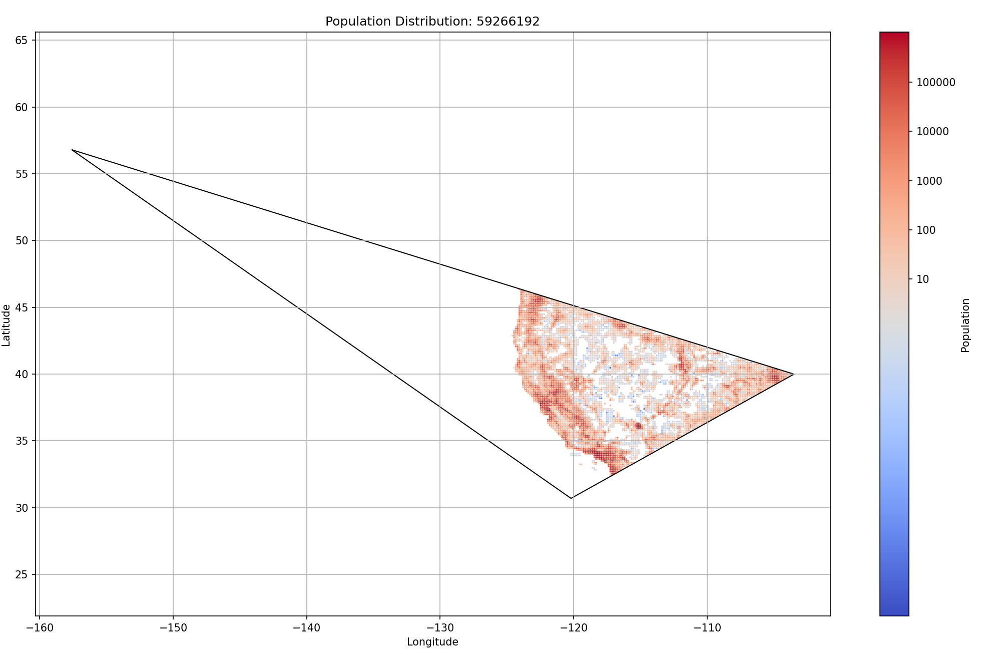
<div style="text-align:center">
    图4-2 查询结果图2
</div>

测试用例3

    geojson_polygon_3 = {
        "type": "Polygon",
        "coordinates": [
            [[80.0, 80.0], [-179.0, 0.0], [80.0, -80.0], [179.0, 0.0]]
        ]
    }

运行结果：

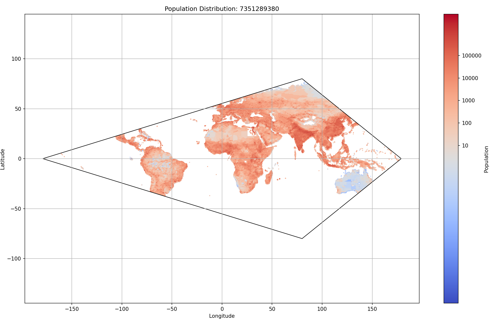
<div style="text-align:center">
    图4-3 查询结果图3
</div>

测试用例4

    geojson_polygon_4 = {
        "type": "Polygon",
        "coordinates": [
            [[105.3, 40.0], [122.0, 40.0], [121.0, 23.5]]
        ]
    }

运行结果；

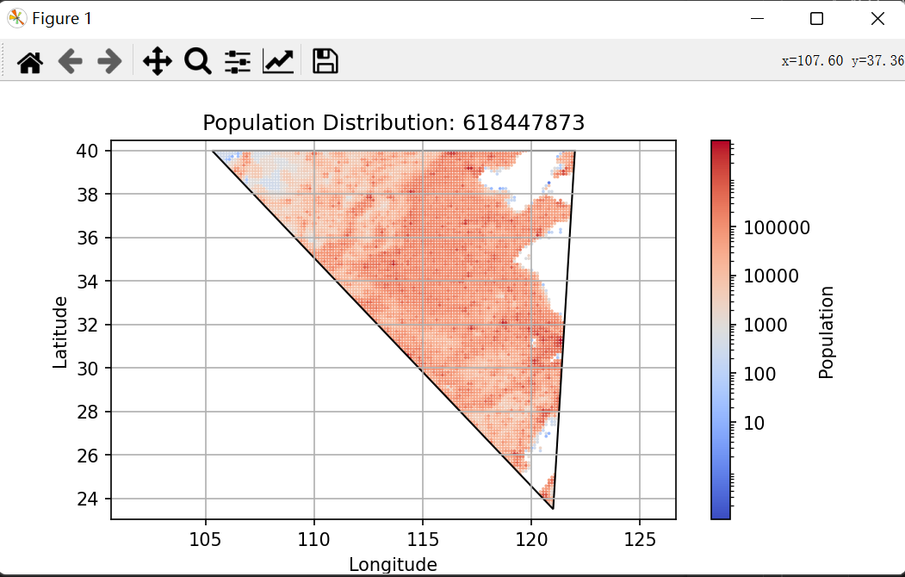
<div style="text-align:center">
    图4-4 查询结果图4
</div>

测试用例5

    geojson_polygon_5 = {
        "type": "Polygon",
        "coordinates": [
            [[90.0, 45.0], [122.0, 40.0], [121.0, 23.5],[101.5, 30.0], [95.0, 38.5]]
        ]
    }

运行结果：

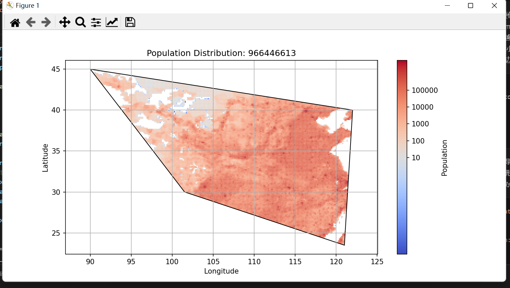
<div style="text-align:center">
    图4-5 查询结果图5
</div>

测试用例6

    geojson_polygon_6 = {
        "type": "Polygon",
        "coordinates": [
            [[-70.0, 20.0], [-90.0, 0.0], [-70.0, -55.0],[-50.0, -45.0], [-30.0, -10.0]]
        ]        
    }

运行结果

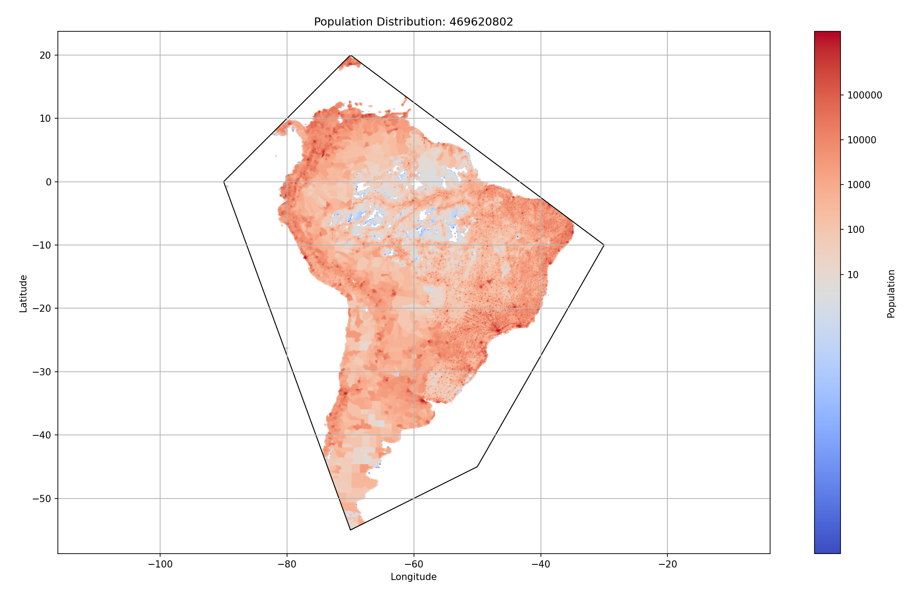
<div style="text-align:center">
    图4-6 查询结果图6
</div>

测试用例7

    geojson_polygon_7 = {
        "type": "Polygon",
        "coordinates": [
            [[-179.0, 89.0], [-179.0, -89.0], [179.0, -89.0]]
        ]
    }

运行结果

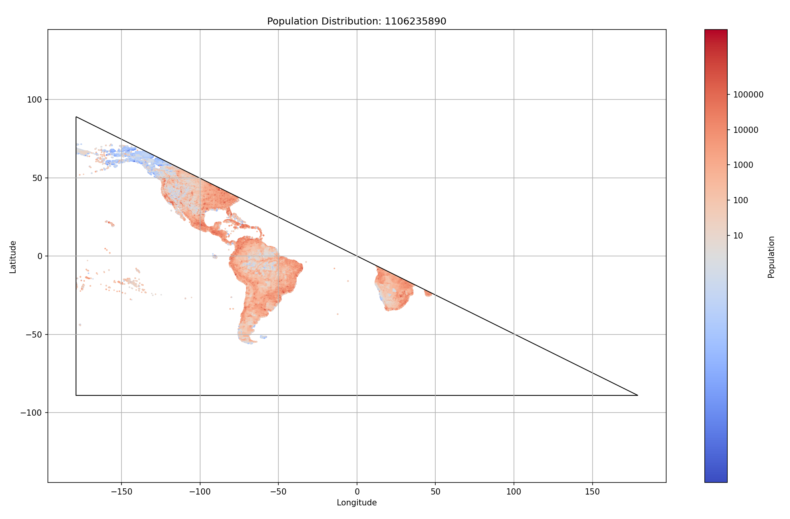
<div style="text-align:center">
    图4-7 查询结果图7
</div>

测试用例8

    geojson_polygon_8 = {
        "type": "Polygon",
        "coordinates": [
            [[-179.0, 89.0], [-179.0, -89.0], [179.0, -89.0], [179.0, 89.0]]
        ]
    }

运行结果

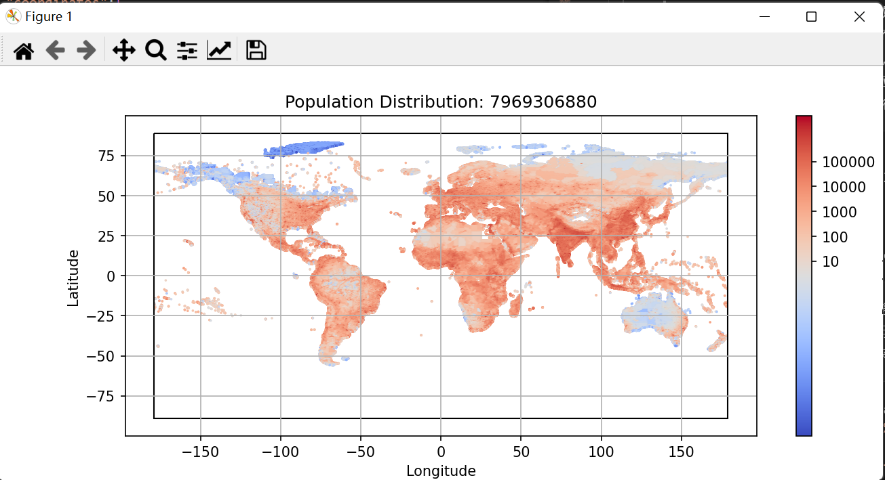
<div style="text-align:center">
    图4-8 查询结果图8
</div>