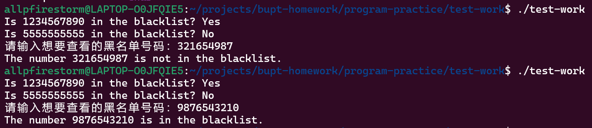

# 第三次小作业（测试）
## 1 作业要求
假如你和你的同学合作一个项目，你负责这个项目的主逻辑，你的同学负责开发一个黑名单模块。


你的主逻辑中会调用黑名单模块，判断一个电话号码是不是在黑名单中。


你们制定了接口，是一个函数调用：


// 如果number在黑名单中，则返回true，否则返回false

bool inBlackList(const char* number);


无论这个黑名单模块是否具备，你需要自己测试你的主逻辑，需要实现一个针对这个接口的测试桩。


作业的要求：


- 针对这个黑名单接口，写一个简单的测试桩，能够方便主逻辑的测试（能够根据不同的输入返回true或者false）


- 需要给出完整的测试桩实现代码


- 对这个测试桩的使用方法做一个简单的说明（写在代码注释中即可）

## 2 测试桩实现
```c
#define _UNIT_TEST_

#include <stdio.h>
#include <string.h>
#include <stdlib.h> 

#define bool int
#define true 1
#define false 0

#ifdef _UNIT_TEST_
// 自己定义的，同学不一定要链表来写
// 定义黑名单节点结构
struct BlackListNode {
    char number[20]; 
    struct BlackListNode* next;
};

// 黑名单链表的头节点
struct BlackListNode* blacklist = NULL;

// 添加号码到黑名单
void addToBlackList(const char* number) {
    struct BlackListNode* newNode = (struct BlackListNode*)malloc(sizeof(struct BlackListNode));
    if (newNode) {
        strcpy(newNode->number, number);
        newNode->next = blacklist;
        blacklist = newNode;
    }
}

// 真正的接口函数
bool inBlackList(const char* number) {
    struct BlackListNode* current = blacklist;
    while (current) {
        if (strcmp(current->number, number) == 0) {
            return true; // 号码在黑名单中
        }
        current = current->next;
    }
    return false; // 号码不在黑名单中
}


// 用于单元测试
int main() {
    addToBlackList("1234567890");
    addToBlackList("9876543210");
    addToBlackList("55555555554");
    addToBlackList("55555555554");
    // 测试1：号码在黑名单中，测试桩返回1
    const char* testNumber1 = "1234567890";
    int result1 = inBlackList(testNumber1);
    printf("Is %s in the blacklist? %s\n", testNumber1, (result1 ? "Yes" : "No"));

    // 测试2：号码不在黑名单中，测试桩返回0
    const char* testNumber2 = "5555555555";
    int result2 = inBlackList(testNumber2);
    printf("Is %s in the blacklist? %s\n", testNumber2, (result2 ? "Yes" : "No"));

    // 测试主逻辑
    char number[20];
    printf("请输入想要查看的黑名单号码：");
    scanf("%s", &number);
    int result = inBlackList(number);
    printf("The number %s is%sin the blacklist.\n", number, (result ? " " : " not "));
    return 0;
}

#else

// 主逻辑
int main()  {
    // 主逻辑代码


    return 0;
}

#endif
```
## 3 运行结果

代码中，测试的黑名单列表有四个，分别是
1234567890、
9876543210、
55555555554、
55555555554。
主逻辑为查询黑名单，测试桩有两个，一个是在黑明单中的1234567890，一个是不在黑名单中的5555555555。\
在主逻辑中，询问用户查询的号码，并告诉用户是否在黑名单中。在主逻辑中也做了两次测试，一次输入在黑名单中的号码，一次输入了不在黑名单中的号码，都得到了正确的结果